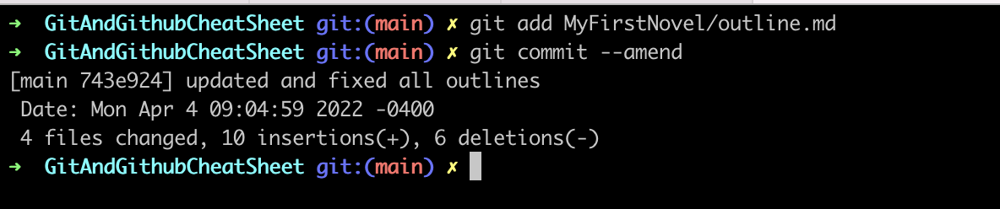
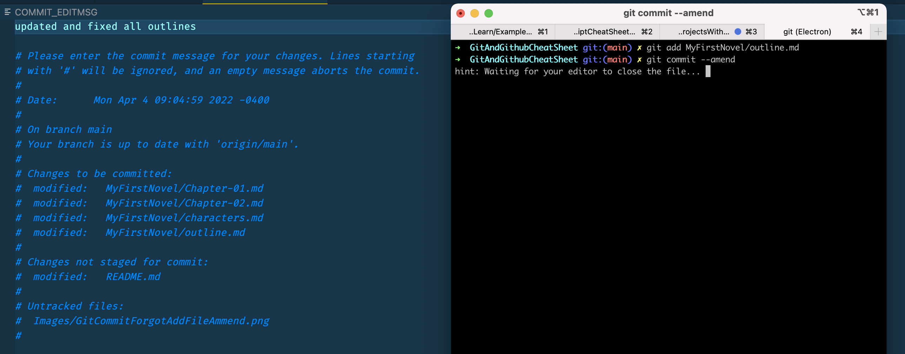
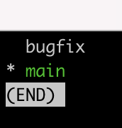
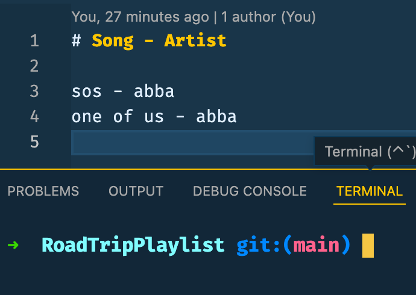
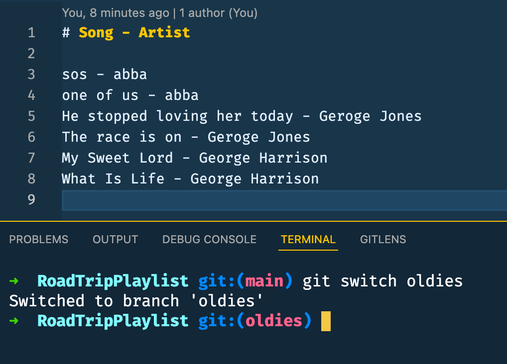
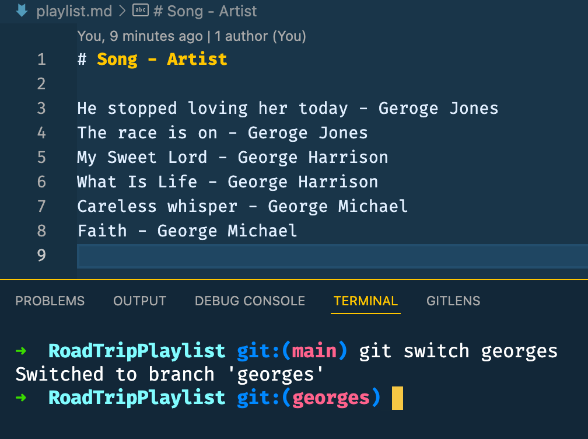
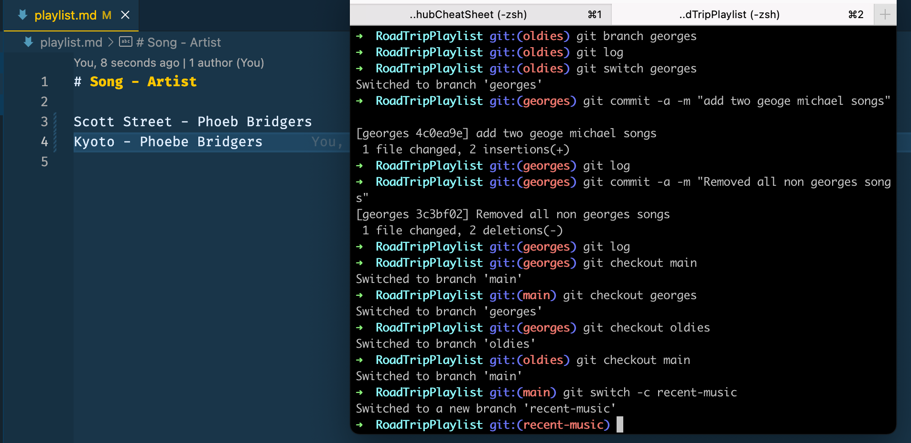

# GitAndGithubCheatSheet

## Section 4: Basics of git: Adding and Committing

git status - gives information on current status of a git repository and it's contents

git init - creates a new git repository. Before we can do anything git-related, we must initialize a git repo first! Done once per poject.

git commit - are "checkpoints" - command to actually commit changes from the staging area
<br>
If you get stuck in VIM editor because you typed in "git commit" then to exit it will be ":q"

git log - retrieves logs of the commits


## Section 5: Commits in Detail

### Atomic Commits

When possible, a commit should encompass a single feature, change, or fix. In other words, try to keep each commit focused on a single thing. This makes it much easier to undo or rollback changes later on. It also makes your code or project easier to review.

- keep each commit focused on "ONE" feature
- Make sure to keep the first line the summary if you have a multiline commit message. This will help with commit history.

### Present Tense or Past Tense?

- Describe changes in imperative mood, "Make xyzzy do frotz" instead "Makes xyzzy do frotz, as if you are giving orders to the codebase to change its behavior.

### Escaping VIM

- If typed in "git commit" by accident and asked to enter a commit message all you have to do it type "i" to enter a commit message or type ":wq" and hit enter.
- We do this when we are on a big project and want to type in a large commit message.
- Use VS code as an editor instead.
- Use code snippet below to change VS Code to default VIM editor
- Note to make sure you have installed "code" command in VS code or the above snippet might not work.

```
git config --global core.editor "code --wait"
```

Type out your commit message, save, and close out of the commit window and your commit will be pushed


### A Closer Look at Git Log Command


git log --oneline


### Amending Commits

- Supposed you just made a commit and then realized you forgot to include a file. Or, maybe you made a type int he message that you wanted to correct.
- Rather than making a brand new separate commit, you can just "redo" the previous commit using the --amend option
- Only works for the previous commit


- Here we see we made edits to to MyFirstNovel/Chapter-01.md, MyFirstNovel/Chapter-02.md, MyFirstNovel/characters.md, and MyFirstNovel/outline.md.

- We committed everything but MyFirstNovel/outline.md
- Git commit --ammend will help save the day
- 
- Remember: This only works for the previous commit.
- A VIM window will open after you "git add "new file" and git commit -- ammend" and you will be able to make edits to your commit message.
- 
- Close the window when you are ready to commit

### Ignoring Files

- Good for API keys, credentials, operating system files, log files, dependencies and packages

- use a file named .gitignore
- .DS_Store will ignore files named .DS_Store
- folderName/ will ignore an entire directory
- \*.log will ignore any files with the .log extension


- secrets.md will not be added

## 6: Working With Branches

- Master was named Main back in 2020 and it is the default branch name. There is nothing special about it.
- Think of branches as bookmarks in a book and only one can be opened.
- Branch pointer - wherea branch is

### Viewing Branches

`git branch` to view you existing branches. The defualt default branch in every git repo is main, thought you can configure this.

- type `q` to get out of branch

### Creating New Branch

`git branch <bugfix>` - enter new name of branch between <>
`git branch` - to see branches available



### Switching between branches

`git switch <branch name>`

`git commit -a -m "commit message"` - is a shortcut way to add and commit all unstaged changes

- Note that where you branch from matters.
  

- Switching to Oldies branch
- 

- Switching to Georges branch
- - 

### Switching with Git Checkout

Git checkout commands does a million additional things, so decision was made to add a standalone switch command which is much simpler.

OR

We can also use `git switch -c <branch name>` as a shortcut for creating and switching to a new branch


### Switching with unstaged changes

Note that you will get an error if you try to switch to a different branch before you save it. So make sure to save and commit everything before switching to a new branch.

- Always add and commit changes before switching branches

### Deleting and Renaming Branches

Use `git branch -D` to delete branches

Use `git branch -m <new name>` - while you are in the branch you want to rename
