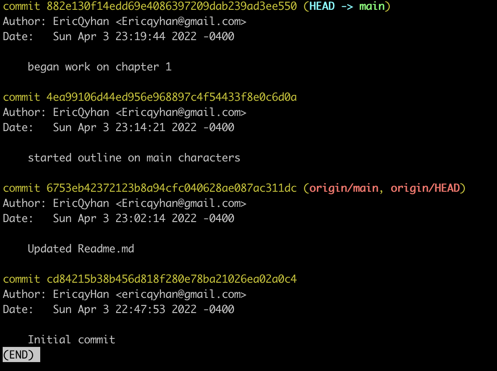

# GitAndGithubCheatSheet

git status - gives information on current status of a git repository and it's contents

git init - creates a new git repository. Before we can do anything git-related, we must initialize a git repo first! Done once per poject.

git commit - are "checkpoints" - command to actually commit changes from the staging area
 
If you get stuck in VIM editor because you typed in "git commit" then to exit it will be ":q"

git log - retrieves logs of the commits

